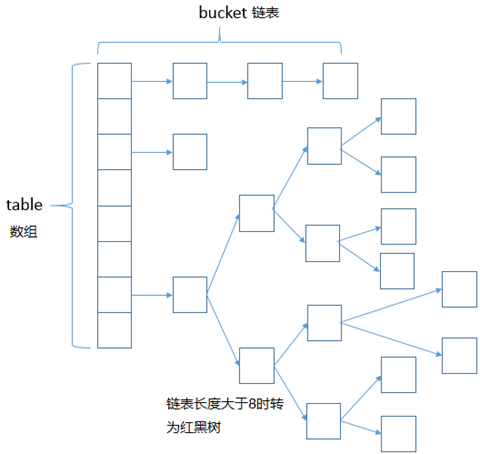
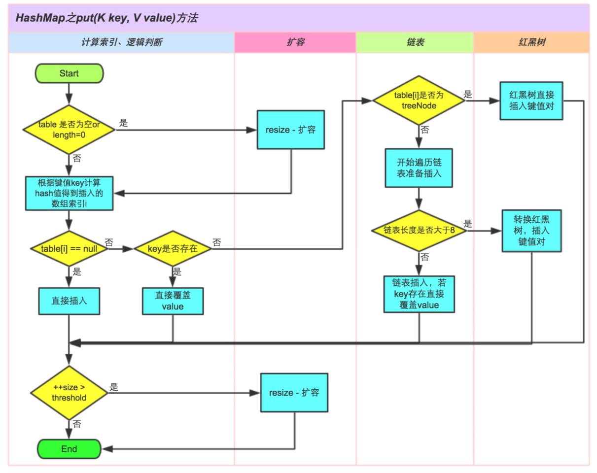

​	在早期的HashMap中，最常用的两种数据结构一种是**数组**，一种是**链表结构**。HashMap为了解决hash算法带来的hash冲突，所以采用了数组和链表的结合模式，它的底层是一个数组，然后根据求得的hash值在数组相应位置将相应的值插入链表中。但是这样的问题就是，数组的某一个桶的元素很多，那么链表就会很长，从而使得访问效率比较低。因此后来HashMap引入了**红黑树**的概念。就是当一个桶的链表上的元素个数达到一定数目之后，便会将链表结构转化为红黑树结构。这样使得访问效率得到了提高，尤其是数量很大的时候。以下便来介绍一下引进红黑树结构的HashMap。

<!-- more -->

### hashmap重要概念

| 变量        | 术语     | 说明                                              |
| :---------- | -------- | ------------------------------------------------- |
| size        | 大小     | HashMap存储大小                                   |
| threshold   | 临界值   | HashMap大小达到临界值，需要重新分配大小           |
| localFactor | 负载因子 | HashMap大小负载因子，默认为75%                    |
| modCount    | 统一修改 | HashMap被修改或者删除的总次数                     |
| Node        | 实体     | HashMap存储对象的实体，由key value hash next组成  |
| TreeNode    | 红黑树   | HashMap红黑树的实现，由parent left right prev red |

### 链表结构

~~~java
    static class Node<K,V> implements Map.Entry<K,V> {
        final int hash;
        final K key;
        V value;
        Node<K,V> next;
        ...省略后续代码
    }
~~~

### 红黑树结构

~~~java
    static final class TreeNode<K,V> extends LinkedHashMap.Entry<K,V> {
        TreeNode<K,V> parent;  // red-black tree links
        TreeNode<K,V> left;
        TreeNode<K,V> right;
        TreeNode<K,V> prev;    // needed to unlink next upon deletion
        boolean red;
        TreeNode(int hash, K key, V val, Node<K,V> next) {
            super(hash, key, val, next);
        }
        ...
    }
~~~

### put

~~~java
public V put(K key, V value) {
        return putVal(hash(key), key, value, false, true);
    }

    final V putVal(int hash, K key, V value, boolean onlyIfAbsent,
                   boolean evict) {
        //tab：当前哈系桶  p：链表节点  n:数组长度   i：链表所在数组中的索引坐标
        Node<K,V>[] tab; Node<K,V> p; int n, i;
        //判断tab[]数组是否为空或长度等于0，进行初始化扩容
        if ((tab = table) == null || (n = tab.length) == 0)
            n = (tab = resize()).length;
        //判断tab指定索引位置是否有元素，没有则，直接newNode赋值给tab[i]
        //i = (n - 1) & hash根据hash快速定位当前key对应的下标
        if ((p = tab[i = (n - 1) & hash]) == null)
            tab[i] = newNode(hash, key, value, null);
        //如果该数组位置存在Node
        else {
            //首先先去查找与待插入键值对key相同的Node，存储在e中，k是那个节点的key
            Node<K,V> e; K k;
            //判断key是否已经存在(hash和key都相等)
            if (p.hash == hash &&
                ((k = p.key) == key || (key != null && key.equals(k))))
                e = p;
            //如果Node是红黑二叉树，则执行树的插入操作
            else if (p instanceof TreeNode)
                e = ((TreeNode<K,V>)p).putTreeVal(this, tab, hash, key, value);
            //否则执行链表的插入操作（说明Hash值碰撞了，把Node加入到链表中）
            else {
                //遍历链表
                for (int binCount = 0; ; ++binCount) {
                    if ((e = p.next) == null) {///遍历到尾部，追加新节点到尾部
                        p.next = newNode(hash, key, value, null);
                        //如果追加节点后，链表数量》=8，则转化为红黑树
                        if (binCount >= TREEIFY_THRESHOLD - 1) // -1 for 1st
                            treeifyBin(tab, hash);
                        break;
                    }
                    //如果找到了要覆盖的节点，则退出循环
                    if (e.hash == hash &&
                        ((k = e.key) == key || (key != null && key.equals(k))))
                        break;
                    //把p执行p的子节点，开始下一次循环（p = e = p.next）
                    p = e;
                }
            }
            //在循环中判断e是否为null，如果为null则表示加了一个新节点，不是null则表示找到了hash、key都一致的Node。
            if (e != null) { // existing mapping for key
                V oldValue = e.value;
                //判断是否更新value值。（map提供putIfAbsent方法，如果key存在，不更新value，但是如果value==null任何情况下都更改此值）
                if (!onlyIfAbsent || oldValue == null)
                    e.value = value;
                //此方法是空方法，什么都没实现，用户可以根据需要进行覆盖
                afterNodeAccess(e);
                return oldValue;
            }
        }
        //只有插入了新节点才进行++modCount；
        ++modCount;
        //如果size>threshold则开始扩容（每次扩容原来的1倍）
        if (++size > threshold)
            resize();
        //此方法是空方法，什么都没实现，用户可以根据需要进行覆盖
        afterNodeInsertion(evict);
        return null;
    }
~~~

### 扩容  

扩容同时满足一下两个条件：

1. 当前数据存储的数量（即size()）必须大于等于阈值
2. 当前加入的数据发生了hash冲突

​        扩容默认是以原有容量的两倍进行扩容。在JDK1.8之后，扩容机制不再进行hash的重计算，由于我们使用的是2次幂进行扩展，所以元素的位置要么在原位置，要么再原位置在移动2次幂的位置。

​	扩容是一个比较耗性能的操作，所以使用HashMap的时候，估算好HashMap的大小，并设置一个大概的值，避免频繁的扩容操作。

### 为什么HashMap的容量是2的幂次方？

​	HashMap中的数据结构是数组+单链表的组合，我们希望的是元素存放的更均匀，最理想的效果是，Node数组中每个位置都只有一个元素，这样，查询的时候效率最高，不需要遍历链表，而且空间利用率最大。那如何计算才会分布最均匀呢？我们首先想到的就是%运算，hash%n=bucketIndex，但是源码是另外一段运算：tab[i = (n - 1) & hash]。当容量一定为2^n时，（n-1）&hash == hash%n，但是位运算效率要高于模运算。

### HashMap如何确保容量是2的幂次方

如果没有传入参数，那么源码中扩容自然是按照2的幂进行扩容，但是如果传入了参数，那么如何保证呢？

传参构造函数：

~~~java
    public HashMap(int initialCapacity, float loadFactor) {
        if (initialCapacity < 0)
            throw new IllegalArgumentException("Illegal initial capacity: " +
                                               initialCapacity);
        if (initialCapacity > MAXIMUM_CAPACITY)
            initialCapacity = MAXIMUM_CAPACITY;
        if (loadFactor <= 0 || Float.isNaN(loadFactor))
            throw new IllegalArgumentException("Illegal load factor: " +
                                               loadFactor);
        this.loadFactor = loadFactor;
        //调用tableSizeFor
        this.threshold = tableSizeFor(initialCapacity);
    }

~~~

tableSizeFor的作用是返回大于等于initialCapacity的最小的2的幂，当传入3的时候返回4，传入5的时候返回8。

~~~java
    public HashMap(int initialCapacity, float loadFactor) {
        if (initialCapacity < 0)
            throw new IllegalArgumentException("Illegal initial capacity: " +
                                               initialCapacity);
        if (initialCapacity > MAXIMUM_CAPACITY)
            initialCapacity = MAXIMUM_CAPACITY;
        if (loadFactor <= 0 || Float.isNaN(loadFactor))
            throw new IllegalArgumentException("Illegal load factor: " +
                                               loadFactor);
        this.loadFactor = loadFactor;
        //tableSizeFor将
        this.threshold = tableSizeFor(initialCapacity);
    }

~~~

但是请注意，这个时候的源码是：

~~~java
this.threshold = tableSizeFor(initialCapacity)
~~~

难道不应该是：

~~~
this.threshold = tableSizeFor(initialCapacity) * this.loadFactor;
~~~

其实在构造方法中，并没有对容量进行初始化，table的初始化其实被推迟到put方法中，在put方法中会对threshold进行重新计算，并对容量进行赋值。put方法在上面已经做了解析，调用初始化代码如下：

~~~java
if ((tab = table) == null || (n = tab.length) == 0)
     n = (tab = resize()).length;
~~~

这时候就会发现，其实初始化的代码在resize()中

~~~java
    final Node<K,V>[] resize() {
        Node<K,V>[] oldTab = table;
        int oldCap = (oldTab == null) ? 0 : oldTab.length;
        int oldThr = threshold;
        int newCap, newThr = 0;
        if (oldCap > 0) {
            if (oldCap >= MAXIMUM_CAPACITY) {
                threshold = Integer.MAX_VALUE;
                return oldTab;
            }
            else if ((newCap = oldCap << 1) < MAXIMUM_CAPACITY &&
                     oldCap >= DEFAULT_INITIAL_CAPACITY)
                newThr = oldThr << 1; // double threshold
        }
        //构造函数带参的时候，会走到这一步
        else if (oldThr > 0) // initial capacity was placed in threshold
            newCap = oldThr;
        else {               // zero initial threshold signifies using defaults
            newCap = DEFAULT_INITIAL_CAPACITY;
            newThr = (int)(DEFAULT_LOAD_FACTOR * DEFAULT_INITIAL_CAPACITY);
        }
        if (newThr == 0) {
            float ft = (float)newCap * loadFactor;
            newThr = (newCap < MAXIMUM_CAPACITY && ft < (float)MAXIMUM_CAPACITY ?
                      (int)ft : Integer.MAX_VALUE);
        }
        threshold = newThr;
        @SuppressWarnings({"rawtypes","unchecked"})
            Node<K,V>[] newTab = (Node<K,V>[])new Node[newCap];
        table = newTab;
        .....
            中间省略代码为对原有数据的重新迁移
        .....
        return newTab;
    }
~~~

其中核心代码

~~~java
int oldThr = threshold;
int newCap, newThr = 0;
newCap = oldThr;
float ft = (float)newCap * loadFactor;
newThr = (newCap < MAXIMUM_CAPACITY && ft < (float)MAXIMUM_CAPACITY ?
                      (int)ft : Integer.MAX_VALUE);
threshold = newThr;
Node<K,V>[] newTab = (Node<K,V>[])new Node[newCap];
table = newTab;
~~~

至此，HashMap的容量已经全部分析完毕