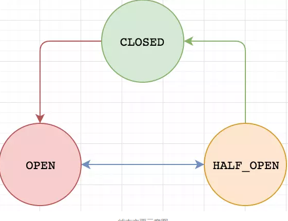

Spring Cloud Hystrix实现了断路器、线程隔离等一系列服务保护措施，它也是基于Netflix的开源框架Hystrix实现的，该框架的目标是通过控制那些访问远程系统、服务和第三方库的节点，从而对延迟和故障提供更强大的容错能力。Hystrix具备服务降级、服务熔断、线程和信号隔离、请求缓存、请求合并以及服务监控等强大功能。

<!--more-->

### 工作流程

以上Hystrix流程图来源于官网：https://raw.githubusercontent.com/wiki/Netflix/Hystrix/images/hystrix-command-flow-chart.png

Hystrix整个工作流如下：

1. 构造一个 HystrixCommand或HystrixObservableCommand对象，用于封装请求，并在构造方法配置请求被执行需要的参数；
2. 执行命令，Hystrix提供了4种执行命令的方法，后面详述；
3. 判断是否使用缓存响应请求，若启用了缓存，且缓存可用，直接使用缓存响应请求。Hystrix支持请求缓存，但需要用户自定义启动；
4. 判断熔断器是否打开，如果打开，跳到第8步；
5. 判断线程池/队列/信号量是否已满，已满则跳到第8步；
6. 执行HystrixObservableCommand.construct()或HystrixCommand.run()，如果执行失败或者超时，跳到第8步；否则，跳到第9步；
7. 统计熔断器监控指标；
8. 走Fallback备用逻辑；
   以下四种情况会触发降级逻辑：
   1. run()方法抛出非HystrixBadRequestException异常。
   2. run()方法调用超时。
   3. 熔断器开启拦截调用。
   4. 线程池/队列/信号量是否跑满
9. 返回请求响应。

#### 执行命令的四种方法

Hystrix提供了4种执行命令的方法，execute()和queue() 适用于HystrixCommand对象，而observe()和toObservable()适用于HystrixObservableCommand对象。

**execute()**

以同步堵塞方式执行run()，只支持接收一个值对象。hystrix会从线程池中取一个线程来执行run()，并等待返回值。

**queue()**

以异步非阻塞方式执行run()，只支持接收一个值对象。调用queue()就直接返回一个Future对象。可通过 Future.get()拿到run()的返回结果，但Future.get()是阻塞执行的。若执行成功，Future.get()返回单个返回值。当执行失败时，如果没有重写fallback，Future.get()抛出异常。

**observe()**

事件注册前执行run()/construct()，支持接收多个值对象，取决于发射源。调用observe()会返回一个hot Observable，也就是说，调用observe()自动触发执行run()/construct()，无论是否存在订阅者。

如果继承的是HystrixCommand，hystrix会从线程池中取一个线程以非阻塞方式执行run()；如果继承的是HystrixObservableCommand，将以调用线程阻塞执行construct()。

observe()使用方法：

1. 调用observe()会返回一个Observable对象
2. 调用这个Observable对象的subscribe()方法完成事件注册，从而获取结果

**toObservable()**

事件注册后执行run()/construct()，支持接收多个值对象，取决于发射源。调用toObservable()会返回一个cold Observable，也就是说，调用toObservable()不会立即触发执行run()/construct()，必须有订阅者订阅Observable时才会执行。

- execute()实际是调用了queue().get()
- queue()实际调用了toObservable().toBlocking().toFuture()
- observe()实际调用toObservable()获得一个cold Observable，再创建一个ReplaySubject对象订阅Observable，将源Observable转化为hot Observable。因此调用observe()会自动触发执行run()/construct()。

Hystrix总是以Observable的形式作为响应返回，不同执行命令的方法只是进行了相应的转换。

### 熔断器原理

熔断器的判断是在判断缓存之后，判断线程池/信号量之前，熔断器的状态：open、closed、half-open。

以上Hystrix流程图来源于官网：https://raw.githubusercontent.com/wiki/Netflix/Hystrix/images/hystrix-command-flow-chart.png

熔断器的整个工作流程如下：

1. 调用allowRequest()判断是否允许将请求提交到线程池
   circuitBreaker.forceOpen和circuitBreaker.forceClosed可以强制修改熔断器状态，而不用关心实际状态。只有在close状态才能执行第二步，否则结束

2. 调用isOpen()判断熔断器开关是否打开
   如果open，进入第三步，否则继续判断
   如果周期内的请求小于circuitBreaker.requestVolumeThreshold的值，放行，否则继续判断
   如果周期内错误率小于circuitBreaker.errorThresholdPercentage，放行，否则打开熔断器，进入第三步

3. 调用allowSingleTest()判断是否允许单个请求通行，检查依赖服务是否恢复

   如果熔断器非close状态，并且距离熔断器打开的时间或上一次试探请求放行的时间超过circuitBreaker.sleepWindowInMilliseconds的值时，熔断器进入half-open状态，允许放行一个试探请求，否则不允许放行

~~~java
public boolean attemptExecution() {
    		//判断强制开启
            if (properties.circuitBreakerForceOpen().get()) {
                return false;
            }
    		//判断强制关闭
            if (properties.circuitBreakerForceClosed().get()) {
                return true;
            }
    		//判断是否关闭
            if (circuitOpened.get() == -1) {
                return true;
            } else {
                //是否超过断开时间
                if (isAfterSleepWindow()) {
                    //设置状态为half-open
                    if (status.compareAndSet(Status.OPEN, Status.HALF_OPEN)) {
                        //only the first request after sleep window should execute
                        return true;
                    } else {
                        return false;
                    }
                } else {
                    return false;
                }
            }
        }
~~~

### 隔离策略

在判断开闭之后，将判断线程池/信号量是否已满。至于选择线程池还是信号量，则是隔离策略的问题。

#### 信号量模式

当 n 个并发请求去调用一个目标服务接口时，都要获取一个信号量才能真正去调用目标服务接口，但信号量有限，默认是 10 个，可以使用 maxConcurrentRequests 参数配置，如果并发请求数多于信号量个数，就有线程需要进入队列排队，但排队队列也有上限，默认是 5，如果排队队列也满，则必定有请求线程会走 fallback 流程，从而达到限流和防止雪崩的目的。

信号量模式从始至终都只有**请求线程自身**，是**同步调用模式**，**不支持超时调用**，**不支持直接熔断**，由于**没有线程的切换**，**开销非常小**。

- 信号隔离也可以用于限制并发访问，防止阻塞扩散, 与线程隔离最大不同在于执行依赖代码的线程依然是请求线程（该线程需要通过信号申请）,
- 如果客户端是可信的且可以快速返回，可以使用信号隔离替换线程隔离,降低开销.
- 信号量的大小可以动态调整, 线程池大小不可以.

#### 线程池模式

当 n 个请求线程并发对某个接口请求调用时，会先从 hystrix 管理的线程池里面获得一个线程，然后将参数传递给这个线程去执行真正调用。线程池的大小有限，默认是 10 个线程，可以使用 maxConcurrentRequests 参数配置，如果并发请求数多于线程池线程个数，就有线程需要进入队列排队，但排队队列也有上限，默认是 5，如果排队队列也满，则必定有请求线程会走 fallback 流程。

线程池模式可以**支持异步调用**，**支持超时调用**，**支持直接熔断**，**存在线程切换**，**开销大**。

#### 区别

线程池隔离技术，不是去控制web容器的线程，而是使用了线程池隔离技术，控制的是web容器中线程的执行，而非web容器本身的线程。

信号量隔离技术，控制的是web容器的线程。

#### 应用场景

**线程池**

大部分的场景下其实都适合用这种技术，对于依赖服务的调用以及访问；能解决场景的timeout的场景，可以避免调用线程阻塞住。 

**信号量**

适合你的访问不依赖于外部服务，而只是**访问内部**的一些复杂的业务逻辑，由于他是内部访问，**不存在timeout的问题**，适合比较复杂逻辑的业务代码，防止大量的线程被这些逻辑给卡死，影响系统的稳定性。

### 实现方式

官方为我们提供了两张实现方式

#### 注解@HystrixCommand

~~~java
　　//请求熔断注解，当服务出现问题时候会执行fallbackMetho属性的名为helloFallBack的方法
    @HystrixCommand(fallbackMethod = "helloFallBack")
    public String helloService() throws ExecutionException, InterruptedException {
        return "hello";
　　}

　　
　　public String helloFallBack(){
    　　return "error";
　　}
~~~

通过注解HystrixCommand，我们可以对熔断器进行各种参数的配置，具体参考官网：https://github.com/Netflix/Hystrix/wiki/Configuration

#### 继承

但是从注解无法详细了解熔断器的本质，所以下面我们来介绍继承的方式。

我们可以继承HystrixCommand或者HystrixObservableCommand，可参考上面所讲的`执行命令的四种方式`

~~~java
public class CommandHelloWorld extends HystrixCommand<String> {

    private final String name;

    public CommandHelloWorld(String name) {
        super(HystrixCommandGroupKey.Factory.asKey("ExampleGroup"));
        this.name = name;
    }

    @Override
    protected String run() {
        return "Hello " + name + "!";
    }
}
~~~

声明一个类`CommandHelloWorld`，继承`HystrixCommand`, HystrixCommand携带泛型，泛型的类型就是我们的执行方法`run()`返回的结果的类型。逻辑执行体就是run方法的实现。
构造方法至少要传递一个分组相关的配置给父类才能实现实例化，具体用来干什么的后面会描述。

测试一下

~~~java
public class CommandHelloWorldTest {
    @Test
    public void test_01(){
        String result = new CommandHelloWorld("world").execute();
        Assert.assertEquals("Hello world!",result);
    }
}
~~~

测试通过

那么分组是什么呢？还有其他什么配置呢？其实这里的配置就对应了注解里面的配置。

Hystrix每个command都有对应的commandKey可以认为是command的名字，默认是当前类的名字`getClass().getSimpleName()`,每个command也都一个归属的分组，这两个东西主要方便Hystrix进行监控、报警等。
HystrixCommand使用的线程池也有线程池key，以及对应线程相关的配置。

详细配置与注解类似，参考官网：https://github.com/Netflix/Hystrix/wiki/Configuration。

在讲工作流程的时候，我们说到，首先判断是否使用缓存响应请求。那么我们下面就实现来缓存。

~~~java
    /**
     * 开启请求缓存，只需重载getCacheKey方法
     * 这里的返回值需要返回一个可以代表同一个请求的String类型值
     * 不同的请求会有不同cacheKey.所以，同一请求第一次访问会调用，之后都会走缓存
     * 好处：    1.减少请求数、降低并发
     *          2.同一用户上下文数据一致
     *          3.这个方法会在run()和contruct()方法之前执行，减少线程开支
     */
    @Override
    protected String getCacheKey() {
        return super.getCacheKey();
    }
~~~

那么要清除缓存要怎么做呢？

~~~java
    /**
     * 清理缓存
     * 开启请求缓存之后，我们在读的过程中没有问题，但是我们如果是写，那么我们继续读之前的缓存了
     * 我们需要把之前的cache清掉
     * 说明 ：   1.其中getInstance方法中的第一个参数的key名称要与实际相同
     *          2.clear方法中的cacheKey要与getCacheKey方法生成的key方法相同
     *          3.注意我们用了commandKey是test,大家要注意之后new这个Command的时候要指定相同的commandKey,否则会清除不成功
     */
    public static void flushRequestCache(Long id){
        HystrixRequestCache.getInstance(
                HystrixCommandKey.Factory.asKey("test"), HystrixConcurrencyStrategyDefault.getInstance())
                .clear(String.valueOf(id));
    }
~~~

其中.clear()中的cacheKey与getCacheKey()返回的String相同，只有把正确需要清除的key清掉才会连同value一同清掉，从而达到清除缓存的作用。

同样，开启缓存的操作也可以使用注解实现，

| 注解         | 描述                                                         | 属性                      |
| ------------ | ------------------------------------------------------------ | ------------------------- |
| @CacheResult | 该注解用来标记请求命令返回的结果应该被缓存，它必须与@HystrixCommand注解结合使用 | cacheKeyMethod            |
| @CacheRemove | 该注解用来让请求命令的缓存失效，失效的缓存根据commandKey进行查找。 | commandKey,cacheKeyMethod |
| @CacheKey    | 该注解用来在请求命令的参数上标记，使其作为cacheKey，如果没有使用此注解则会使用所有参数列表中的参数作为cacheKey | value                     |

详细使用方式可自行百度。

### Hystrix配合Feign

~~~java
@Component
@FeignClient(value = "repertory-service", path = "/repertory", fallback = OrderService.OrderServiceFallback.class)
public interface OrderService {
    @GetMapping("test2")
    String test2();

    @Component
    class OrderServiceFallback implements OrderService {
        @Override
        public String test2() {
            return "OrderServiceFallback";
        }
    }
}
~~~

默认情况下，feign不支持hystrix，所以我们需要手动开启。

~~~
feign:
  hystrix:
    enabled: true
~~~

