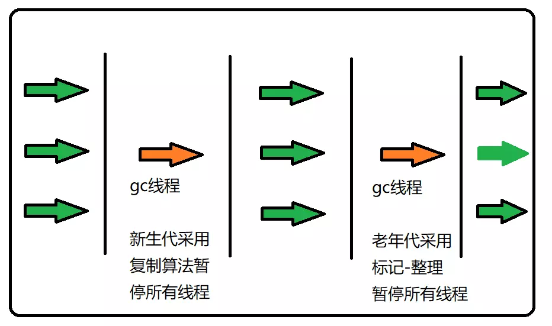

[TOC]

## 如何判断对象需要被回收

### 引用计数法

​	引用计数是垃圾收集器中的早期策略。在这种方法中，堆中每个对象实例都有一个引用计数。当一个对象被创建时，就将该对象实例分配给一个变量，该变量计数设置为1。当任何其它变量被赋值为这个对象的引用时，计数加1（a = b,则b引用的对象实例的计数器+1），但当一个对象实例的某个引用超过了生命周期或者被设置为一个新值时，对象实例的引用计数器减1。任何引用计数器为0的对象实例可以被当作垃圾收集。当一个对象实例被垃圾收集时，它引用的任何对象实例的引用计数器减1。

​	但是，引用计数法无法解决对象直接相互引用的问题。例如以下代码：

~~~java
public class ReferenceFindTest {
    public static void main(String[] args) {
        //object1计数+1
        MyObject object1 = new MyObject();
        //object2计数+1
        MyObject object2 = new MyObject();
        //object2计数+1
        object1.object = object2;
        //object1计数+1
        object2.object = object1;
        //object1计数-1
        object1 = null;
        //object2计数-1
        object2 = null;
    }
}
~~~

​	当object1、object2都设置为null之后，他们的计数器为1，还存在内部相互引用，从而不能得到回收。

### 可达性分析法

​	通过一系列的称为 GC Roots 的对象作为起点, 然后向下搜索; 搜索所走过的路径称为引用链/Reference Chain, 当一个对象到 GC Roots 没有任何引用链相连时, 即该对象不可达, 也就说明此对象是不可用的, 如下图:虽然E和F相互关联， 但它们到GC Roots是不可达的, 因此也会被判定为可回收的对象。

## 垃圾回收算法

### 标记-清除算法

​	标记清楚法有两个过程，一是标记过程，即判定需要回收的对象的过程，通过可达性分析便可分析出来。二是清除阶段，这个阶段就是对标记了的对象进行回收。 

​	简单粗暴，但是也暴露出一个问题：GC后造成了**大量的内存碎片**，如果之后要分配大内存对象，可能无法找到连续的内存，而频繁出发GC。

### 复制算法

​	为了解决内存碎片问题，复制算法出现了，它将可用内存平均划分为两块，每次只使用其中一块。当这一块用完了，就将还存活的对象复制到另一块，然后再把已使用的内存空间一次清理掉。这样每次GC的时候都直接回收半个内存空间的大小，不必考虑碎片问题。但这种方法带来的代价也不小**，牺牲了一半的存储空间。** 

### 标记-整理算法

​	如果在对象存活率较高的时候采用复制算法的话，复制的操作就会有很多，对程序的运行效率也会产生一定的影响，此时就应该考虑标记整理法。标记整理法的执行过成分为3步：

1. 用与“标记清除法”一样的操作标记存活的对象；
2. 将被标记的对象全部移动到内存的某一端；
3. 清除边界以外部分的内存。 

### 分代回收算法

​	在分代回收算法中，会根据对象的存活周期，将内存划分为几块，一般是新生代（Young Generation）、老年代(Old Generation)、永久代(Permanent Generation)。这样就可以根据不同内存区域的特点执行采用不同的回收算法。像新生代这种经常有大批对象死去的区域，就适合用复制算法。而对于老年代这种对象生存周期较长和永久代这种内存存活率较高，又没有其他担保空间的地方就用标记清除法或标记整理法就行了。

#### 新生代

​	新生代中存放着刚创建的对象，或者经过多次GC依然没有回收的对象。对于新生代，往往会分为三个区：一个Eden区和两个Survivor区,比例为8：1：1。（图中是S0和S1，其实这两个区域没有任何区别，只是取个名字方便叙述）。这样划分后结合复制算法对垃圾进行回收效果和效率都会比较高。

​	程序中大部分对象都是在新生代的Eden区域中，当GC来临时，会遵循如下机制： 

1. 当Eden区域触发GC的时候，将Eden中还存活的对象复制到S0中，再清空Eden区。 
2. 然后当S0触发GC时候，将S0和Eden中还存活的对象复制到S1中，再清空S0和Eden区。 
3. 当S1也触发GC的时候,就将此区域内的从S0复制过来并且GC后还存活的对象复制到老年代，再清空S1。 

值得注意的是：GC发生的时机是根据剩余内存的大小和具体的算法来决定的，不一定是当内存存满了才触发一次GC。新生代的GC指的是**Minor GC**，也就是用一些快速回收算法实现的高效率GC，这种方式只会对新生代进行回收。

#### 老年代

​	老年代中则**存放着新生代复制过来的对象**，这些一般都是经历过多次GC存活下来的对象，所以这里的对象生存的时间都比较长。当老年代存满了时候，会调用Full GC也就是对整个堆（包括新生代、老年代、永久代）进行回收，这样的回收更彻底，但是时间也消耗更多。

#### 永久代

​	永久代一般用来存放一些**静态变量，静态方法**等，这里一般发生GC的概率比较小，但是一旦存满，也是会直接触发Full GC的。

## 算法实现

### 枚举根节点

在可达性分析法中提到的GC Root就是枚举根节点。在枚举GC Root的时候，程序需要停顿（不能出现在分析过程中，引用关系还在变化），所以我们不能花费大量的时间去遍历，而虚拟机提供了OopMap的数据结构来达到这个目的。在加载类的时候，HotSpot把对象内什么偏移量是什么类型的数据计算出来，在编译过程中，也会在特定的位置记录下栈和寄存器中哪些位置是引用。这样，GC在扫描的时候就能直接得到信息了。

在Java, 可作为GC Roots的对象包括:

1. 方法区: 类静态属性引用的对象;
2. 方法区: 常量引用的对象;
3. 虚拟机栈(本地变量表)中引用的对象.
4. 本地方法栈JNI(Native方法)中引用的对象。

### 安全点

但是我们总不能每执行一条指令，就生成一次OopMap吧，所以我们需要在特定的位置去生成OopMap。这些特定的位置，就叫安全点。安全点的选择是以程序`是否具有让程序长时间执行的特征`为标准选定的。反正我没看懂，大致产生安全点的位置在：方法调用、循环跳转、异常跳转等。

那么如何在发生GC的时候，让所有的线程都"跑"到最近的安全点再停顿下来呢？以下有两种方案选择：

1. 抢先式中断（Preemptive Suspension）：在GC发生时，首先把所有线程全部中断，如果发现有线程中断的地方不在安全点上，就恢复线程，让它“跑”到安全点上。现在**几乎没有虚拟机实现采用抢先式中断**来暂停线程从而响应GC事件。
2. 主动式中断（Voluntary Suspension）： 在安全点设置一个标志，各个线程执行时主动去轮询这个标志，发现中断标志为true时就自己中断挂起。

### 安全区

但是如果程序不执行了（sleep状态或者block状态），那么是不能到达安全点的，那么就有了安全区域的概念。

安全区域是指在一段代码片段之中，引用关系不会发生变化。在这个区域中的任意地方开始GC都是安全的。我们也可以把Safe Region看做是被扩展了的Safepoint。

在线程执行到Safe Region中的代码时，首先标识自己已经进入了Safe Region，那样，当在这段时间里JVM要发起GC时，就不用管标识自己为Safe Region状态的线程了。在线程要离开Safe Region时，它要检查系统是否已经完成了根节点枚举（或者是整个GC过程），如果完成了，那线程就继续执行，否则它就必须等待直到收到可以安全离开Safe Region的信号为止。

## 垃圾回收器

上图中展示了七种作用于不同分代的收集器。如果两个收集器之间存在连线，就说明它们可以搭配使用。 

### 术语解析

#### 吞吐量

吞吐量=运行用户代码时间/（运行用户代码时间+垃圾收集时间）。

虚拟机总共运行100分钟，其中垃圾收集运行了一分钟，那么吞吐量就是99%。

#### 并发

可以**和应用程序同时运行**的垃圾回收程序。

#### 并行

使用**多线程执行回收**操作的垃圾回收程序。

#### minor GC

发生在新生代（Young generation）的GC称为`Minor GC`。

#### full GC

对整个堆空间进行GC的称为Full GC--新生代和老年代。

#### Concurrent Mode Failure

### Serial（复制算法)

Serial收集器是Hotspot运行在Client模式下的**默认新生代收集器**, 它在进行垃圾收集时，会暂停所有的工作进程，用一个线程去完成GC工作

### Serial Old(标记-整理算法)

Serial Old与Serial基本一致，只不过一个工作再新生代，一个工作在老年代，算法也不同。主要运行在Client模式下。

在server模式下，有两个用途：

1. 配合Parallel，一个应用于新生代，一个应用于老年代。
2. 作为CMS的备选方案，当发生Concurrent Mode Failure时使用。

### ParNew(复制算法)

ParNew收集器其实是Serial的多线程版本，回收策略完全一样，作用于新生代。新生代如果使用ParNew，那老年代只能使用CMS和serial。

### Parallel(复制算法)

多线程收集器，作用于新生代，但是他与ParNew不同点是，Parallel的目标是达到一个可控的吞吐量，他提供了两个参数用于精确控制吞吐量，分别控制最大垃圾收集停顿时间（-XX:MaxGCPauseMillis）和直接设置吞吐量大小	。			（-XX:GCTimeRatio）。

但是控制吞吐量并不代表能使垃圾回收更快，而是以牺牲新生代空间换取的，收集300M新生代肯定比收集500M要快。

### Parallel Old(复制算法)

多线程收集器，作用于老年代。

在Parallel Old没出来之前，如果新生代使用Parallel，那么老年代只能只用Serial，新生代多线程，老年代单线程，直接拖累了性能，出了 Parallel Old之后，两者就可以搭配使用。

### CMS（标记-清理算法）

全称concurrent mark sweep，从名字可知，是一个并发的、使用标记清除算法的垃圾回收器。他的目标是获取最短回收停顿时间。

CMS过程：

1. 初始标记
   标记GC Root能直接关联到的对象，需要stop the world，时间很短。
2. 并发标记
   进行GC Root Tracing（跟踪）过程，和用户线程并发执行。
3. 重新标记
   修改在并发标记期间，用户程序继续运作而导致的标记记录产生变动的标记记录，需要stop the world，时间比初始标记要长一点，但远比并发标记要短。
4. 并发清除
   清理垃圾对象，和用户线程并发执行。

优点：

1. 并发收集
2. 低停顿

缺点：

1. 对CPU资源比较敏感，在并发阶段，虽然不会导致用户线程停顿，但是会占用一部分线程资源，降低系统的总吞吐量。
2. 无法处理浮动垃圾，在并发清理阶段，用户线程的运行依然会产生新的垃圾对象，这部分垃圾只能在下一次GC时收集。
3. CMS是基于标记-清除算法实现的，没有任何的碎片整理机制，意味着收集结束后会造成大量的内存碎片，可能导致出现老年代剩余空间很大，却无法找到足够大的连续空间分配当前对象，不得不提前触发一次Full GC。

### G1（标记-清理 ，复制）

​	G1收集器（或者垃圾优先收集器）的设计初衷是为了尽量缩短处理超大堆时产生的停顿。在回收的时候将对象从一个小堆区复制到另一个小堆区，这意味着G1在回收垃圾的时候同时完成了堆的部分内存压缩，相对于CMS的优势而言就是内存碎片的产生率大大降低。

​	heap被划分为一系列大小相等的“小堆区”，也称为region。每个小堆区（region）的大小为1~32MB，整个堆**大致**要划分出2048个小堆区。

G1过程：

1. 初始标记
   标记一下GC Roots能直接关联到的对象，并且修改TAMS的值，让下一个阶段用户程序并发运行时，能在正确可用的Region中创建新对象，这一阶段需要停顿线程，但是耗时很短，
2. 并发标记
   从GC Root开始对堆中对象进行可达性分析，找出存活的对象，这阶段时耗时较长，但可与用户程序并发执行。
3. 最终标记修正在并发标记期间因用户程序继续运作而导致标记产生变动的那一部分标记记录，虚拟机将这段时间对象变化记录在线程Remenbered Set Logs里面，最终标记阶段需要把Remembered Set Logs的数据合并到Remembered Set Logs里面，最终标记阶段需要把Remembered Set Logs的数据合并到Remembered Set中，这一阶段需要停顿线程，但是可并行执行。
4. 筛选回收
   首先对各个Region的回收价值和成本进行排序，根据用户所期望的GC停顿时间来制定回收计划。

优点：

1. 并行+并发
2. 分代收集
   分代概念在G1中依然保留，但G1不需要其他收集器配合，即可完成整个堆收集。
3. 空间整合
   从整体来看，基于标记整理算法，从局部（两个region）来看，基于复制算法。所以不会产生空间碎片。
4. 可预测的停顿
   可以指定垃圾回收时间不超过N毫秒，G1通过回收价值和成本进行排序，即G1过程的`筛选回收`

### G1对比CMS区别

1. 作用域：CMS作用于老年代；G1作用于整个堆
2. 实现算法：CMS采用标记清除算法；G1整体上采用标记整理算法，局部使用复制算法
3. 空间整合能力：CMS无法对内存碎片进行整合；G1不存在内存碎片
4. 实现方式：CMS采用传统的内存分配与回收；G1将内存划分为region来进行内存分配与回收。

## GC触发时机

### Minor GC

当Eden区满时，触发Minor GC。

### Full GC

1. 显示调用System.gc时，系统建议执行Full GC，但是不必然执行。
2. 老年代空间不足
3. 方法区空间不足
4. 新生代需要GC前，判断进入老年代的平均大小大于老年代的最大连续空间，大于则进行Full GC。
5. 由Eden区、From Space区向To Space区复制时，对象大小大于To Space可用内存，则把该对象转存到老年代，且老年代的可用内存小于该对象大小

## 内存分配与回收策略

### 对象优先在Eden分配

​	**对象通常在新生代的Eden区进行分配**，当Eden区没有足够空间进行分配时，虚拟机判判断老年代的连续空间是否大于新生代对象总大小或者历次晋升的平均大小，大于则Minor GC ，小于则Full GC，如果内存依然不够，则通过空间分配担保进入老年代。

### 大对象直接进入老年代

​	需要大量连续内存空间的Java对象称为大对象，大对象的出现会导致提前触发垃圾收集以获取更大的连续的空间来进行大对象的分配。虚拟机提供了-XX:PretenureSizeThreadshold参数来设置大对象的阈值，超过阈值的对象直接分配到老年代。

### 长期存活的将进入老年代

​	每个对象有一个对象年龄计数器，与前面的对象的存储布局中的GC分代年龄对应。对象出生在Eden区、经过一次Minor GC后仍然存活，并能够被Survivor容纳，设置年龄为1，对象在Survivor区每次经过一次Minor GC，年龄就加1，当年龄达到一定程度（默认15），就晋升到老年代，虚拟机提供了-XX:MaxTenuringThreshold来进行设置。

### 动态对象年龄判断

​	对象的年龄到达了MaxTenuringThreshold可以进入老年代，同时，**如果在survivor区中相同年龄所有对象大小的总和大于survivor区的一半，年龄大于等于该年龄的对象就可以直接进入老年代**。无需等到MaxTenuringThreshold中要求的年龄。

### 空间分配担保

​	 在发生Minor GC时，虚拟机会检查老年代连续的空闲区域是否大于新生代所有对象的总和，若成立，则说明Minor GC是安全的，否则，虚拟机需要查看HandlePromotionFailure的值，看是否运行担保失败，若允许，则虚拟机继续检查老年代最大可用的连续空间是否大于历次晋升到老年代对象的平均大小，若大于，将尝试进行一次Minor GC；若小于或者HandlePromotionFailure设置不运行冒险，那么此时将改成一次Full GC，以上是JDK Update 24之前的策略，之后的策略改变了，**只要老年代的连续空间大于新生代对象总大小或者历次晋升的平均大小就会进行Minor GC，否则将进行Full GC。**

​	冒险是指经过一次Minor GC后有大量对象存活，而新生代的survivor区很小，放不下这些大量存活的对象，所以需要老年代进行分配担保，把survivor区无法容纳的对象直接进入老年代。

## JDK8取消永久代

Java7中已经将运行时常量池从永久代移除，在Java 堆（Heap）中开辟了一块区域存放运行时常量池。 
Java8中，已经彻底没有了永久代，将方法区直接放在一个与堆不相连的本地内存区域，这个区域被叫做元空间。

JDK1.7之前的版本 

其中最上一层是Nursery内存，一个对象被创建以后首先被放到Nursery中的Eden内 
存中，如果存活期超两个Survivor之后就会被转移到长时内存中(Old Generation)中。

JDK1.8版本 

JDK8中把存放元数据中的永久内存从堆内存中移到了本地内存(native memory)中，这样永久内存就不再占用堆内存，它可以通过自动增长来避免JDK7以及前期版本中常见的永久内存错误(Java.lang.OutOfMemoryError: PermGen)。

JDK8也提供了一个新的设置Matespace内存大小的参数：-XX:MaxMetaspaceSize=128m

注意：如果不设置JVM将会根据一定的策略自动增加本地元内存空间。如果你设置的元内存空间过小，你的应用程序可能得到以下错误：java.lang.OutOfMemoryError: Metadata space

