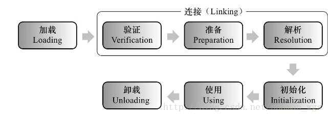

[TOC]

### 面试题

~~~java
class Singleton{
    private static Singleton singleton = new Singleton();
    public static int value1;
    public static int value2 = 0;

    private Singleton(){
        value1++;
        value2++;
    }

    public static Singleton getInstance(){
        return singleton;
    }

}

class Singleton2{
    public static int value1;
    public static int value2 = 0;
    private static Singleton2 singleton2 = new Singleton2();

    private Singleton2(){
        value1++;
        value2++;
    }

    public static Singleton2 getInstance2(){
        return singleton2;
    }

}

public static void main(String[] args) {
        Singleton singleton = Singleton.getInstance();
        System.out.println("Singleton1 value1:" + singleton.value1);
        System.out.println("Singleton1 value2:" + singleton.value2);

        Singleton2 singleton2 = Singleton2.getInstance2();
        System.out.println("Singleton2 value1:" + singleton2.value1);
        System.out.println("Singleton2 value2:" + singleton2.value2);
    }
~~~

结果：

~~~java
Singleton1 value1 : 1 
Singleton1 value2 : 0 
Singleton2 value1 : 1 
Singleton2 value2 : 1
~~~

### 类加载机制

JVM类加载分为5个过程：加载，验证，准备，解析，初始化，使用，卸载，如下图所示： 

#### 加载

加载主要是将.class文件（并不一定是.class。可以是ZIP包，网络中获取）中的二进制字节流读入到JVM中。 
在加载阶段，JVM需要完成3件事： 

1. **通过类的全限定名获取该类的二进制字节流；** 
   jvm并没有指明需要从Class文件中获取，也可以通过ZIP包、网络、动态代理方式或者是其它文件数据库等资源类型中获取二进制字节流。
2. **将字节流所代表的静态存储结构转化为方法区的运行时数据结构；** 
   虚拟机外部的二进制字节流就按照虚拟机的格式，存储在方法区之中，方法区中的数据存储格式由虚拟机实现自行定义。 方法区中静态常量池转为运行时常量池。
3. **在内存中生成一个该类的java.lang.Class对象，作为方法区这个类的各种数据的访问入口。**
   然后在内存中实例化一个java.lang.Class类对象（虽然是对象，但是存放在方法区中），这个对象将作为程序访问方法区中的这些数据类型的外部接口。 
   作为堆中对象实例访问数据的接口（引用）

#### 验证

验证是连接阶段的第一步，主要确保加载进来的字节流符合JVM规范。 
验证阶段会完成以下4个阶段的检验动作： 

1. **文件格式验证** **（二进制字节流验证）**
   针对字节流是否符合Class文件格式规范的验证，包括 ： 
   ①是否以魔数开头。 
   ②主次版本号是否在当前虚拟机处理范围。 
   ③检查常量池中的常量类型，索引值和编码数据格式等等…… 
   该阶段是保证输入的二进制字节流能够正确的解析并存储到方法区中，只有通过了文件格式的验证，字节流才会进入方法区。 

   并且后面的3个验证阶段全部是基于方法区的存储结构进行的。

2. **元数据验证(方法区存储结构)** 
   元数据是描述数据的数据，直白来说就是描述代码间的关系。检验包括 ： 

   1. 这个类是否有父类。（除了java.lang.Object之外） 
   2. 这个类的父类是否继承了不允许的类。（final修饰的类） 
   3. 如果这个类不是抽象类，是否实现了父类或接口中要求实现的所有方法。 
   4. 类中的字段，方法是否与父类产生矛盾等等…

3. **字节码验证（确定程序语义合法，符合逻辑）** 这个阶段是整个验证阶段中最复杂的，字节码验证将对类的方法体进行校验分析。 

   1. 保证操作数栈的数据类型与指令代码序列正确配合。（例如操作数栈处理int类型后，不会按照long类型加入局部变量表） 
   2. 保证跳转指令不会跳转到方法体外的字节码指令上。 
   3. 保证方法体中的类型转换是有效的。（向上转型）等等……

4. **符号引用验证（确保下一步的解析能正常执行）**

   这个阶段发生在虚拟机将符号引用转化为直接引用时候（解析阶段），确保解析能够正常的执行。 
   符号引用验证是常量池中各种符号引用信息的匹配性检验，通常校验一下内容 ： 

   1. 符号引用中通过字符串描述的全限定名是否能找到对应的类。 
   2. 在指定类中是否存在符合方法和字段描述所对应的方法和字段。 
   3. 符号引用中的类、字段、方法的访问性（private、protected、public、default）等等……

**注：**

加载是将class文件读入到JVM中，最终保存在方法区中，而验证中需要对文件格式进行验证，字节流才能进入方法区。这里其实并不冲突，只不过是在加载的时候，会进行验证，所以说这两个过程其实是并行的。

#### 准备

准备阶段是正式为类变量（static修饰的成员变量）分配内存并设置初始值的阶段。 

~~~java
//类变量value1在准备阶段过后的初始值是 0 。存储在方法区中。
public static int value1 = 123;
//value2称为常量，并存储在方法区的类常量池中，并且在准备阶段value2就会被赋值，即value2 = 123。
public final static int value2 = 123;
~~~

#### 解析

解析阶段是虚拟机将常量池内的符号引用替换为直接引用的过程。

符号引用 ： 任何形式的字面量（Class文件中）来描述所引用的目标。

直接引用 ： 直接引用已经存在于内存中，并且可以是直接执行目标的指针、相对偏移量或者是一个能间接定位到目标的句柄。

解析动作主要针对类或接口、字段、类方法、接口方法、方法类型、方法句柄和调用限定符7类符号引用运行。

#### 初始化

初始化阶段是类加载过程的最后一步，主要是根据程序中的赋值语句主动为类变量赋值。 
注： 

1. 当有父类且父类为初始化的时候，先去初始化父类； 
2. 再进行子类初始化语句。

初始化触发条件：

1. 遇到new 、get static（读取类变量）、put static（设置类变量）、invoke static（调用类变量）这4条字节码指令。
2. 使用java.lang.reflect包的方法对类进行反射调用时。
3. 初始化一个类，发现其父类没有初始化，则需要先触发父类的初始化（注：1. 接口除外，父接口在调用的时候才会被初始化；2.子类引用父类静态字段，只会引发父类初始化）； 
4. 被标明为启动类的类（即包含main()方法的类）要初始化； 
5. 当使用JDK1.7的动态语言支持时，如果一个java.invoke.MethodHandle实例最后的解析结果REF_getStatic、REF_putStatic、REF_invokeStatic的方法句柄，并且这个方法句柄所对应的类没有进行过初始化，则需要先触发其初始化。

### 分析面试题

Singleton输出结果：1 0 

~~~java
1 首先执行main中的Singleton singleton = Singleton.getInstance(); 
2 类的加载：加载类Singleton 
3 类的验证 
4 类的准备：为静态变量分配内存，设置默认值。这里为singleton(引用类型)设置为null,value1,value2（基本数据类型）设置默认值0 
5 类的初始化（按照赋值语句进行修改）： 
执行private static Singleton singleton = new Singleton(); 
执行Singleton的构造器：value1++;value2++; 此时value1，value2均等于1 
执行 
public static int value1; 
public static int value2 = 0; 
此时value1=1，value2=0

~~~

Singleton2输出结果：1 1 

~~~java
1 首先执行main中的Singleton2 singleton2 = Singleton2.getInstance2(); 
2 类的加载：加载类Singleton2 
3 类的验证 
4 类的准备：为静态变量分配内存，设置默认值。这里为value1,value2（基本数据类型）设置默认值0,singleton2(引用类型)设置为null, 
5 类的初始化（按照赋值语句进行修改）： 
执行 
public static int value2 = 0; 
此时value2=0(value1不变，依然是0); 
执行 
private static Singleton singleton = new Singleton(); 
执行Singleton2的构造器：value1++;value2++; 
此时value1，value2均等于1,即为最后结果
~~~

