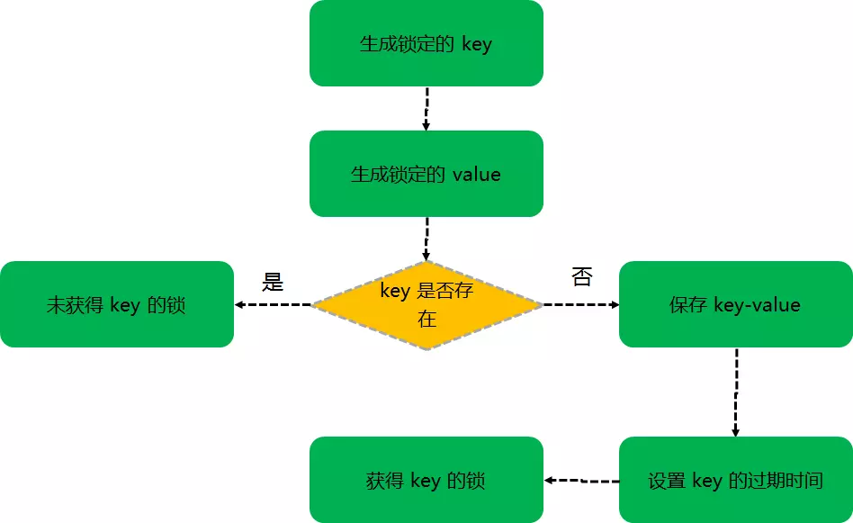

<!--more-->

### 分布式锁使用场景

​	场景一：从前端界面发起一笔支付请求，如果前端没有做防重处理，那么可能在某一个时刻会有二笔一样的单子同时到达系统后台。

​	场景二：在App中下订单的时候，点击确认之后，没反应，就又点击了几次。在这种情况下，如果无法保证该接口的幂等性，那么将会出现重复下单问题。 

​	如果是单机情况下（单JVM），线程之间共享内存，只要使用线程锁就可以解决并发问题。

​	如果是分布式情况下（多JVM），线程A和线程B很可能不是在同一JVM中，这样线程锁就无法起到作用了，这时候就要用到分布式锁来解决。

### 分布式锁的常用三种实现

1. 数据库乐观锁实现
2. zookeeper实现
3. Redis实现 

本文主要讨论Redis的实现方式。

### 加锁

根据以上逻辑，我们用代码来实现

~~~java
jedis.select(dbIndex);
String key = KEY_PRE + key;
String value = fetchLockValue();
if(jedis.exists(key)){
  jedis.set(key,value);
  jedis.expire(key,lockExpirseTime);
  return value;
}
~~~

​	但是这段代码真的能实现分布式锁吗？其实是不能的，因为**判断 key 是否存在**、**保存 key-value**、**设置 key 的过期时间**这三步操作必须是原子性的，否则就会出现以下两种情况：

1. 在判断key不存在之后，保存key-value之前，如果有多个客户端走到这一步，那么就会导致多个客户端获取同一个锁。
2. 如果在保存key-value之后，设置key的过期时间之前，程序崩溃导致设置过期时间没有执行，那么就导致该锁没有设置过期时间而无法被释放。

redis 在2.6.12版本之后，对 set 命令进行了扩充，能够规避上面的两个问题。新版的 redis set 命令如下：

~~~java
/**
@param lockId  当前锁的key值
@param requestId 当前加锁的任务的请求标识，可以用线程id，或者分布式唯一id，可以保证全局唯一即可，作为当前锁的value值使用，用作删除或 延时是判断是否是持有锁的任务
@param second  过期时间，避免锁未正常释放时形成死锁
*/
client.set(lockId,requestId,"nx","ex",second);
~~~

### 解锁

​	

根据以上逻辑，我们用代码来实现：

~~~java
jedis.select(dbIndex);
String key = KEY_PRE + key;
if(jedis.exists(key) && value.equals(jedis.get(key))){
    jedis.del(key);
    return true;
}
return false;
~~~

​	与加锁类似的，**key是否存在**、**判断是否为自己持有锁**、**删除key-value**这三个步骤也应该是原子的，否则就会出现以下情况：

1. 在判断是自己持有锁之后，删除key-value之前，过期时间到了，并且此时另一个客户端进行了加锁操作，那么就会出现释放这个刚加的锁的情况。

   在这里我们使用lua脚本的能力来解决原子操作问题：

   ~~~java
   /**
   @param lockId  当前锁的key值
   @param requestId 请求标识，删除前判断是否是持有锁的任务
   */
   String luaScript = "if redis.call('get', KEYS[1]) == ARGV[1] " +
                   "then return redis.call('del', KEYS[1]) " +
                   "else return 0 end";
   Object rst = client.eval(luaScript, Collections.singletonList(lockId), Collections.singletonList(requestId));
   ~~~

### 守护线程解决业务逻辑没执行完锁已过期的问题

#### 什么是守护线程

​	Java的线程分为两种：User Thread(用户线程)、DaemonThread(守护线程)。

​	只要当前JVM实例中尚存任何一个非守护线程没有结束，守护线程就全部工作；只有当最后一个非守护线程结束是，守护线程随着JVM一同结束工作，Daemon作用是为其他线程提供便利服务，守护线程最典型的应用就是GC(垃圾回收器)，他就是一个很称职的守护者。

​	User和Daemon两者几乎没有区别，唯一的不同之处就在于虚拟机的离开：如果 User Thread已经全部退出运行了，只剩下Daemon Thread存在了，虚拟机也就退出了。 因为没有了被守护者，Daemon也就没有工作可做了，也就没有继续运行程序的必要了。

#### 守护线程如何解决问题

​	其实很简单，当设置锁的过期时间快结束的时候，我们对的过期时间再进行设置即可。那么守护线程需要做的事情就是对过期时间进行再设置，当业务逻辑执行完，并且确保所有的用户线程全部执行完，那么守护进行就会停止工作。

~~~java
/**
@param key  当前锁的key值
@param val 当前加锁的任务的请求标识，可以用线程id，或者分布式唯一id，可以保证全局唯一即可，作为当前锁的value值使用，用作删除或 延时是判断是否是持有锁的任务
@param expireTime  过期时间，避免锁未正常释放时形成死锁
*/
public void redisLockAndDaemonThread(final Jedis jedis, String key, String val, int expireTime){
    String luaScript = "if redis.call('get',KEYS[1]) == ARGV[1] then return redis.call('del',KEYS[1]) else return 0 end";
    try{
        String response = jedis.set(key, val, "NX", "PX", expireTime);
        if(!"OK".equals(response)){
            return;
        }
        //开启守护线程：
        final int tmpExpireTime = expireTime;
        final String tmpKey = key;
        Thread thread = new Thread(new Runnable(){
            @Override
            public void run() {
                for(;;){
                    jedis.expire(tmpKey,tmpExpireTime);
                    try {
                        Thread.sleep(tmpExpireTime);
                    } catch (InterruptedException e) {
                        e.printStackTrace();
                    }
                }
            }
        });
        thread.setDaemon(true);
        thread.start();
        //.....执行业务逻辑
    }catch (Exception e){

    }finally {
        jedis.eval(luaScript,Arrays.asList(key),Arrays.asList(val));
    }
}
~~~

