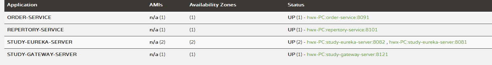

### 概述

Spring Cloud Gateway 是 Spring Cloud 的一个全新项目，该项目是基于 Spring 5.0，Spring Boot 2.0 和 Project Reactor 等技术开发的网关，它旨在为微服务架构提供一种简单有效的统一的 API 路由管理方式。

Spring Cloud Gateway 作为 Spring Cloud 生态系统中的网关，目标是替代 Netflix Zuul，其不仅提供统一的路由方式，并且基于 Filter 链的方式提供了网关基本的功能，例如：安全、监控、埋点和限流等。

Spring Cloud Gateway 的特征：

- 基于 Spring Framework 5，Project Reactor 和 Spring Boot 2.0
- 动态路由
- Predicates 和 Filters 作用于特定路由
- 集成 Hystrix 断路器
- 集成 Spring Cloud DiscoveryClient
- 易于编写的 Predicates 和 Filters
- 限流
- 路径重写

### vs Netflix Zuul

Zuul 基于 Servlet 2.5（使用 3.x），使用阻塞 API，它不支持任何长连接，如 WebSockets。而 Spring Cloud Gateway 建立在 Spring Framework 5，Project Reactor 和 Spring Boot 2 之上，使用**非阻塞 API**，支持 WebSockets，并且由于它与 Spring 紧密集成，所以将会是一个更好的开发体验。

### 术语

- **Route（路由）**：这是网关的基本构建块。它由一个 ID，一个目标 URI，一组断言和一组过滤器定义。如果断言为真，则路由匹配。
- **Predicate（断言）**：这是一个 [Java 8 的 Predicate](http://docs.oracle.com/javase/8/docs/api/java/util/function/Predicate.html)。输入类型是一个 [`ServerWebExchange`](https://docs.spring.io/spring/docs/5.0.x/javadoc-api/org/springframework/web/server/ServerWebExchange.html)。我们可以使用它来匹配来自 HTTP 请求的任何内容，例如 headers 或参数。
- **Filter（过滤器）**：这是`org.springframework.cloud.gateway.filter.GatewayFilter`的实例，我们可以使用它修改请求和响应。

### 流程

客户端向 Spring Cloud Gateway 发出请求。然后在 Gateway Handler Mapping 中通过断言（Predicate）找到与请求相匹配的路由，将其发送到 Gateway Web Handler。Handler 再通过指定的过滤器链来将请求发送到我们实际的服务执行业务逻辑，然后返回。
过滤器之间用虚线分开是因为过滤器可能会在发送代理请求之前（“pre”）或之后（“post”）执行业务逻辑。

### 准备

新建工程，引入gateway依赖和eureka依赖

~~~xml
        <dependency>
            <groupId>org.springframework.cloud</groupId>
            <artifactId>spring-cloud-starter-gateway</artifactId>
        </dependency>
        <dependency>
            <groupId>org.springframework.cloud</groupId>
            <artifactId>spring-cloud-starter-netflix-eureka-client</artifactId>
        </dependency>
~~~

注意：只需要导入依赖即可，不需要修改启动类，不需要添加`@EnableDiscoveryClient`。

### 路由

#### 默认路由规则

application.yml 配置文件内容如下：

~~~yml
spring:
  application:
    name: cloud-gateway
  cloud:
    gateway:
      discovery:
        locator:
          enabled: true
#      routes:
#        - id: default_path_to_http
#          uri: https://windmt.com
#          order: 10000
#          predicates:
#            - Path=/**
#          filters:
#            - SetPath=/
~~~

配置说明

- `spring.cloud.gateway.discovery.locator.enabled`：是否与服务注册于发现组件进行结合，通过 serviceId 转发到具体的服务实例。默认为`false`，设为`true`便开启通过服务中心的自动根据 serviceId 创建路由的功能。

此时如果我们要访问order-service下的/order/test接口，那么我们可以这样访问：

`localhost:9121/ORDER-SERVICE/order/test。

默认情况下application name需要大写。

如果需要小写，可以添加配置：

~~~yml
  cloud:
    gateway:
      discovery:
        locator:
          enabled: true
          lower-case-service-id: true
~~~

 其中`lower-case-service-id: true`就是配置小写。

#### 自定义路由

但是这种必须将 serviceId 大写的方式还是比较蛋疼的，虽然 Eureka 注册中心默认显示的都是大写的，但是这大写的路径放在 URL 真的好吗？我唯一能想到的好处就是能清晰分辨出 serviceId 和 path。

那么现在来配置一下自定义路由：

~~~yml
  cloud:
    gateway:
      discovery:
        locator:
          enabled: true
          lower-case-service-id: true
      routes:
      #网关路由到订单服务order-service
      - id: ORDER-SERVICE           
      #uri以lb://开头（lb代表从注册中心获取服务），后面接的就是你需要转发到的服务名称，这个服务名称必须跟eureka中的对应.
        uri: lb://ORDER-SERVICE/order
        predicates:
          - Path=/order/**
        filters:
          - StripPrefix=1
      	  - AddResponseHeader=X-Response-Default-Foo, Default-Bar

~~~

这样，匹配断言的路径就会被转发到`ORDER-SERVICE/order`。

Spring Cloud Gateway 也支持通过 Java 的流式 API 进行路由的定义，如下就是一个和上边通过配置文件配置的等效的路由，并且可以和配置文件搭配使用。

~~~java
@Bean
public RouteLocator customerRouteLocator(RouteLocatorBuilder builder) {
    // @formatter:off
    return builder.routes()
            .route(r -> r.path("/order/**")
                         .filters(f -> f.stripPrefix(1)
                                        .addResponseHeader("X-Response-Default-Foo", "Default-Bar"))
                         .uri("lb://ORDER-SERVICE/order")
                         .order(0)
                         .id("ORDER-SERVICE")
            )
            .build();
    // @formatter:on
}
~~~

### 过滤器

在路由中，我们无意中配置了过滤器。其实Spring Cloud Gateway 已经内置了很多实用的过滤器，但是可能还是不能满足我们的需求，所以我们就来讲一下过滤器。

在`流程`中有讲到：过滤器之间用虚线分开是因为过滤器可能会在发送代理请求之前（“pre”）或之后（“post”）执行业务逻辑。所以过滤器的生命周期只有`pre`和`post`。

 Spring Cloud Gateway 基于 Project Reactor 和 WebFlux，采用响应式编程风格，打开它的 Filter 的接口`GatewayFilter`、`GlobalFilter`你会发现只需要实现一个方法：`Mono<Void> filter(ServerWebExchange exchange, GatewayFilterChain chain)`

#### 局部过滤器

自定义过滤器需要实现`GatewayFilter`和`Ordered`，我们需要实现GatewayFilter中的filter方法。而`Ordered`中的`int getOrder()`方法是来给过滤器设定优先级别的，值越大则优先级越低。

~~~java
public class CustomFilter implements GatewayFilter, Ordered {

    private static final Log log = LogFactory.getLog(CustomFilter.class);
    private static final String ELAPSED_TIME_BEGIN = "elapsedTimeBegin";

    @Override
    public Mono<Void> filter(ServerWebExchange exchange, GatewayFilterChain chain) {
        exchange.getAttributes().put(ELAPSED_TIME_BEGIN, System.currentTimeMillis());
        return chain.filter(exchange).then(
                Mono.fromRunnable(() -> {
                    Long startTime = exchange.getAttribute(ELAPSED_TIME_BEGIN);
                    if (startTime != null) {
                        log.info(exchange.getRequest().getURI().getRawPath() + ": " + (System.currentTimeMillis() - startTime) + "ms");
                    }
                })
        );
    }

    @Override
    public int getOrder() {
        return Ordered.LOWEST_PRECEDENCE;
    }
}
~~~

~~~java
@Configuration
public class GatewayFilterConfig {
    @Bean
    public RouteLocator routeLocator(RouteLocatorBuilder builder) {
        return builder.routes().route(r ->
                r.path("/order/**")
                        .uri("lb://ORDER-SERVICE/order")
                        .filters(new CustomFilter())
                        .id("order-service"))
                .build();
    }
}
~~~

现在再来看我们之前的问题：怎么来区分是 “pre” 还是 “post” 呢？其实就是`chain.filter(exchange)`之前的就是 “pre” 部分，之后的也就是`then`里边的是 “post” 部分。

#### 全局过滤器

只需要将之前实现的接口`GatewayFilter`改成`GlobalFilter`即可。

~~~java
public class TokenFilter implements GlobalFilter, Ordered {

    @Override
    public Mono<Void> filter(ServerWebExchange exchange, GatewayFilterChain chain) {
        String token = exchange.getRequest().getQueryParams().getFirst("token");
        if (token == null || token.isEmpty()) {
            exchange.getResponse().setStatusCode(HttpStatus.UNAUTHORIZED);
            return exchange.getResponse().setComplete();
        }
        return chain.filter(exchange);
    }

    @Override
    public int getOrder() {
        return -100;
    }
}
~~~

然后在 Spring Config 中配置这个 Bean

~~~java
@Bean
public TokenFilter tokenFilter(){
    return new TokenFilter();
}
~~~

#### 过滤器工厂

### 限流