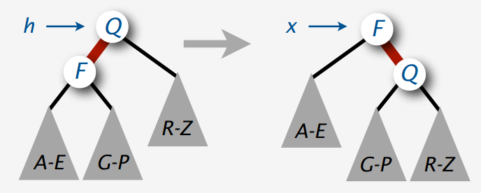

红黑树的应用场景经典为HashMap和TreeMap。

<!--more-->

为了查找的方便，我们学会了二叉查找树，但是二叉查找树在极端情况下会退化成链表，最坏时间复杂度为O(N)。为了解决二叉查找树的不平衡，2-3树孕育而生，2-3树是一个绝对平衡树，即根节点到任意一个子节点的节点数量都是相同的。但是2-3-4树的实现较为复杂，所以诞生了红黑树。红黑树是2-3-4树的一种等同。

## 2-3-4树

### 定义

2-3树意思就是树里有两种节点:
`2-node`: 保存1个key,左右2个子节点，
`3-node`: 保存2个key,左中右3个子节点。
`4-node`: 保存3个key,左中右4个子节点。

### 插入

对于2-3-4树来说添加节点绝对不会添加到一个空的位置。当加入一个元素的时候，他会先添加到最后一个叶子节点上，如果添加之后形成了4-node，那么在添加之前先将3-node分裂成树，然后再进行添加，然后自下而上重复该操作。具体情况如下：

1. 如果我们要融合的节点是2-node，我们就直接融合成一个3-node。
2. 如果我们融合的节点是3-node，我们就直接融合成一个4-node。
3. 如果我们融合的节点是4--node，那就要分为两种情况进行区分：
   1. 4-node 的父节点是2-node
      
   2. 4-node的父节点是3-node
      

## 红黑树

### 演变

那么2-3-4树又如何演变成红黑树呢？那么我们规定如下等价：

3-node的转化其实存在左倾和右倾情况，所以我们认为定义为左倾红黑树。

这样，一个2-3-4数就演变成了红黑树。

### 红黑树的性质

1. 每个节点都是黑色或者红色
2. 根节点是黑色的
3. 每个叶子节点（最后的空节点）是黑色的
4. 如果一个节点是红色的，那么他的两个叶子节点都是黑色的
5. 从任意一个节点到叶子节点，经过的黑色节点都一样的

2、3性质其实很容易根据红黑树的演变过程能够得到。5性质还是要回到2-3-4树的本质。2-3-4树是一个绝对平衡树，所以任意一个节点到叶子节点的高度都是一致的，而根据红黑树的演变过程可知，经过的黑色节点数量其实就是2-3-4树的高度。

### 自平衡策略

rotateLeft

rotateRight

rotateColor

### 红黑树对比AVL树

AVL树是最早发明的自平衡二叉树，在AVL树中，任何节点的两个子节点的最大高度差为1。最大高度为logN。在实现中，为了确保最大高度差，AVL树需要保存节点高度。

红黑树的最大高度为2logN，所以在查询上的速度，比AVL树要慢一些，但是时间复杂度其实都是O(logN)。但是红黑树不需要保存节点高度，插入删除的实现相对AVL更简单，所以红黑树相比AVL树更普遍。

红黑树相对于AVL树来说，牺牲了部分平衡性以换取插入/删除操作时少量的旋转操作，整体来说性能要优于AVL树。

https://juejin.im/post/5a3b7c476fb9a044fe4689e3#heading-5

